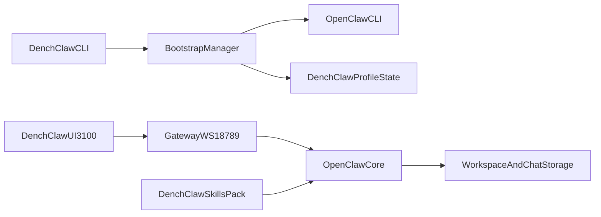

# DenchClaw Frontend-Only Rewrite (No-Break Migration)

## Locked Decisions

- Runtime topology: OpenClaw Gateway stays on its normal port (default `18789`), DenchClaw UI runs on `3100`.
- Update policy: install OpenClaw once, then update only when user explicitly approves.

## Target Architecture

## Why This Rewrite Is Needed (from current code)

- Web chat currently spawns the CLI directly in `[apps/web/lib/agent-runner.ts](apps/web/lib/agent-runner.ts)` (`openclaw.mjs` + `--stream-json`), which tightly couples UI and CLI process model.
- DenchClaw product content is hardcoded in core prompt generation in `[src/agents/system-prompt.ts](src/agents/system-prompt.ts)` (`buildDenchClawSection`).
- Web workspace/profile logic in `[apps/web/lib/workspace.ts](apps/web/lib/workspace.ts)` is not aligned with core state-dir resolution in `[src/config/paths.ts](src/config/paths.ts)` and profile env wiring in `[src/cli/profile.ts](src/cli/profile.ts)`.
- Bootstrapping and daemon install logic already exists and should be reused, not forked: `[src/commands/onboard.ts](src/commands/onboard.ts)`, `[src/wizard/onboarding.finalize.ts](src/wizard/onboarding.finalize.ts)`, `[src/commands/daemon-install-helpers.ts](src/commands/daemon-install-helpers.ts)`.

## Implementation Plan (Phased, Strangler Pattern)

## Phase 1: Freeze Behavior With Contract Tests

- Add regression tests that codify current DenchClaw-critical behavior before changing architecture:
  - stream transport + session subscribe behavior (`--stream-json`, `--subscribe-session-key`) from `[src/cli/program/register.agent.ts](src/cli/program/register.agent.ts)` and `[src/commands/agent-via-gateway.ts](src/commands/agent-via-gateway.ts)`.
  - workspace/profile + web-chat path behavior from `[apps/web/lib/workspace.ts](apps/web/lib/workspace.ts)` and `[apps/web/lib/workspace-profiles.test.ts](apps/web/lib/workspace-profiles.test.ts)`.
  - always-on injected skill behavior for Dench skill loading.
- Produce a “must-pass” migration suite so we can safely refactor internals without user-visible regressions.

## Phase 2: Create DenchClaw Bootstrap Layer (Separate CLI Behavior)

- Introduce a bootstrap command path for `denchclaw` that:
  - verifies OpenClaw availability;
  - installs OpenClaw if missing (first-run flow);
  - runs onboarding (`openclaw --profile denchclaw onboard --install-daemon`);
  - starts/opens UI at `http://localhost:3100`.
- Reuse existing onboarding/daemon machinery instead of duplicating logic in a second stack:
  - `[src/commands/onboard.ts](src/commands/onboard.ts)`
  - `[src/wizard/onboarding.finalize.ts](src/wizard/onboarding.finalize.ts)`
  - `[src/daemon/constants.ts](src/daemon/constants.ts)`
- Add explicit update prompt UX (policy #2): no silent auto-upgrades.

## Phase 3: Decouple UI Streaming From CLI Process Spawn

- Extract gateway streaming client logic from `[src/commands/agent-via-gateway.ts](src/commands/agent-via-gateway.ts)` into a reusable library module.
- Migrate web chat runtime from “spawn CLI process” to “connect directly to gateway stream API” in:
  - `[apps/web/lib/agent-runner.ts](apps/web/lib/agent-runner.ts)`
  - `[apps/web/lib/active-runs.ts](apps/web/lib/active-runs.ts)`
  - `[apps/web/app/api/chat/route.ts](apps/web/app/api/chat/route.ts)`
  - `[apps/web/app/api/chat/stream/route.ts](apps/web/app/api/chat/stream/route.ts)`
- Keep a temporary compatibility flag for rollback during rollout.

## Phase 4: Unify Profile + Storage Resolution

- Replace web-only state resolution logic with shared core semantics from `[src/config/paths.ts](src/config/paths.ts)` and profile env behavior from `[src/cli/profile.ts](src/cli/profile.ts)`.
- Normalize chat/workspace storage to profile-scoped OpenClaw state consistently (no split-brain between `~/.openclaw-*` and `~/.openclaw/web-chat-*` behaviors).
- Add one-time migration for existing `.denchclaw-ui-state.json` / web-chat index data to the new canonical profile paths.

## Phase 5: Move DenchClaw Product Layer Outside Core

- Externalize DenchClaw-specific identity/prompt sections currently in `[src/agents/system-prompt.ts](src/agents/system-prompt.ts)` behind a product adapter/config hook.
- Move Dench/DenchClaw always-on skill packaging out of core bundled defaults and load it as DenchClaw-provided skill pack.
- Keep `inject` capability in core, but remove hardcoded DenchClaw assumptions from default OpenClaw prompt path.

## Phase 6: Onboarding UX Hardening (Zero-Conf Side-by-Side)

- First-run checklist in DenchClaw bootstrap:
  - OpenClaw installed and version shown
  - profile verified (`denchclaw`)
  - gateway reachable
  - UI reachable at `3100`
  - clear remediation output for port/token/device mismatch
- Ensure side-by-side safety with OpenClaw main profile (no daemon overwrite, no shared session collisions).

## Phase 7: Rollout and Safety Gates

- Roll out behind feature gates with staged enablement:
  1. internal
  2. opt-in beta
  3. default
- Block full cutover until migration suite and onboarding E2E checks pass.
- Keep legacy path available for one release as emergency fallback.

## Definition of Done

- `npx denchclaw` bootstraps OpenClaw (if missing), runs guided onboarding, and reliably opens/serves UI on `localhost:3100`.
- DenchClaw runs alongside default OpenClaw without daemon/profile/token collisions.
- Stream, workspaces, always-on skills, and storage features remain intact during and after migration.
- OpenClaw upgrades do not break DenchClaw because integration is through stable gateway/CLI interfaces, not forked internals.
