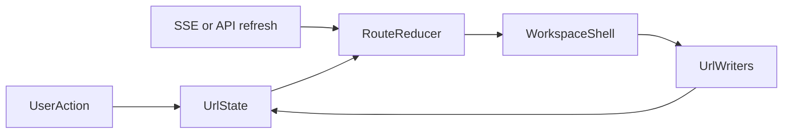

# Root URL Refactor

## Target Architecture

- Make the real app live at `[apps/web/app/page.tsx](apps/web/app/page.tsx)` instead of the current landing page, and retire `[apps/web/app/workspace/page.tsx](apps/web/app/workspace/page.tsx)` as an app shell.
- Keep `/workspace` only as a compatibility entry that redirects to `/` while preserving search params, so existing chat/file/object links do not break.
- Establish a single canonical root query model, owned by a typed codec in `[apps/web/lib/workspace-links.ts](apps/web/lib/workspace-links.ts)` or a new sibling helper.
- Treat the URL as the source of truth for navigable/restorable state, not just an effect sink.

## Refactor Seams

- Extract a typed `WorkspaceUrlState` parser/serializer from the current `/workspace` helpers in `[apps/web/lib/workspace-links.ts](apps/web/lib/workspace-links.ts)`. It should cover at least:
  - root app mode: chat vs file/object/document/report/database vs cron
  - `path`, `entry`, `chat`, `subagent`, `send`
  - browse-mode directory state and `showHidden`
  - right-sidebar preview target
  - object view state: active view, view type, filters, search, sort, page, pageSize, visible columns, view settings that affect rendering
- Add a contract-lifting phase before URL sync so child components stop owning route-relevant state:
  - lift table column visibility and related callbacks out of the table layer so object views can serialize a single canonical column state
  - change subagent navigation to use stable child session keys/metadata from the parent shell rather than task-label lookup in the message renderer
  - identify any other child-local route-bearing state during implementation and convert it to controlled props before wiring it to the URL
- Refactor the page-level state machine out of `[apps/web/app/workspace/page.tsx](apps/web/app/workspace/page.tsx)` into a reusable root-shell component/hook so URL decoding happens on every navigation change, not only once through `initialPathHandled`.
- Convert imperative `/workspace` pushes/replaces throughout the app to root-route updates, including `[apps/web/app/components/sidebar.tsx](apps/web/app/components/sidebar.tsx)`, `[apps/web/app/components/workspace/database-viewer.tsx](apps/web/app/components/workspace/database-viewer.tsx)`, `[apps/web/app/components/workspace/document-view.tsx](apps/web/app/components/workspace/document-view.tsx)`, `[apps/web/app/components/workspace/markdown-editor.tsx](apps/web/app/components/workspace/markdown-editor.tsx)`, `[apps/web/app/components/workspace/slash-command.tsx](apps/web/app/components/workspace/slash-command.tsx)`, and `[apps/web/lib/workspace-cell-format.ts](apps/web/lib/workspace-cell-format.ts)`.
- Move browse/workspace traversal state in `[apps/web/app/hooks/use-workspace-watcher.ts](apps/web/app/hooks/use-workspace-watcher.ts)` behind URL-backed inputs so folder navigation, `..`, and workspace-root return are all reload-safe.
- Rework object view state in `[apps/web/app/workspace/page.tsx](apps/web/app/workspace/page.tsx)` and related components so the browser URL drives table/kanban/calendar/timeline/list/gallery rendering, filters, sort, search, pagination, and column visibility. The existing server query contract already supports much of this and should become the canonical browser contract too.
- Fix subagent deep-linking by routing with stable child session keys instead of the current task-label click path in `[apps/web/app/components/chat-message.tsx](apps/web/app/components/chat-message.tsx)`, then teach the main shell to restore subagent context from URL on refresh/back/forward.
- Preserve live `.object.yaml` edits by making SSE-driven saved-view updates recompute and rewrite the current URL state when the active view definition changes.

## Testing Strategy

- Update existing helper tests that currently hard-code `/workspace`, especially `[apps/web/lib/workspace-links.test.ts](apps/web/lib/workspace-links.test.ts)`, `[apps/web/lib/workspace-cell-format.test.ts](apps/web/lib/workspace-cell-format.test.ts)`, and `[apps/web/app/workspace/workspace-switch.test.ts](apps/web/app/workspace/workspace-switch.test.ts)`.
- Add focused Vitest coverage for the new URL codec and route reducer so the core contract is mutation-resistant:
  - legacy `/workspace?...` migration into root URLs
  - precedence rules when `path`, `chat`, `entry`, `subagent`, and preview state coexist
  - contract tests proving lifted child state flows through controlled props/callbacks before URL serialization
  - object filter/sort/search/page/pageSize/column/view serialization round-trips
  - SSE/view-sync behavior when `.object.yaml` changes the active view
- Add browser E2E coverage for real navigation behavior because Vitest does not currently cover page-router behavior end to end:
  - open from copied URL, refresh, and restore
  - back/forward across chat, subagent, file, entry modal, cron, and browse-mode transitions
  - object view deep links for table/kanban and filter/search/sort/pagination/column state
  - legacy `/workspace` links redirecting to `/` without losing state
- Use the existing test-writer approach to prioritize invariants over snapshots: deep-link restoration, canonical URL updates after user actions, and state staying in sync when server-persisted view definitions change under the user.

## Main Risks To Manage

- `[apps/web/app/workspace/page.tsx](apps/web/app/workspace/page.tsx)` is both the current shell and the current state machine; splitting route logic from rendering will be the highest-risk step.
- Some state is still trapped inside child components, especially column visibility and subagent selection, so those contracts will need lifting before URL sync can be reliable.
- Mitigation for child-owned state risk: do the extraction first, add narrow contract tests around the lifted interfaces, then wire those parent-owned values into the URL layer instead of changing ownership and routing in one step.
- There is already a dirty worktree outside this refactor (`extensions/posthog-analytics/index.ts`, `src/cli/bootstrap-external.ts`), so the implementation should avoid touching unrelated changes while we migrate the web app.

