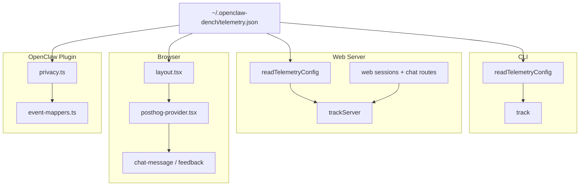

# Unified Anonymous Install ID

## What the runtime evidence showed

We already have concrete evidence that identity is fragmented:

- `[src/telemetry/telemetry.ts](src/telemetry/telemetry.ts)` uses a **machine hash** via `getAnonymousId()`.
- `[extensions/posthog-analytics/lib/event-mappers.ts](extensions/posthog-analytics/lib/event-mappers.ts)` also uses a **machine hash** for all `$ai_*` events.
- `[apps/web/lib/telemetry.ts](apps/web/lib/telemetry.ts)` falls back to `**randomUUID()`** when `distinctId` is not explicitly passed.
- `[apps/web/app/components/posthog-provider.tsx](apps/web/app/components/posthog-provider.tsx)` initializes `posthog-js` without a server-provided bootstrap distinct ID, so the browser can mint its own in-memory identity.
- `[apps/web/app/api/web-sessions/shared.ts](apps/web/app/api/web-sessions/shared.ts)` stores session metadata but has no persisted telemetry identity.

That means a single user can show up as 3 separate “people” in PostHog:

- browser distinct ID
- server random UUID
- OpenClaw plugin machine hash

## Target architecture

The correct source of truth is the DenchClaw state dir, not the browser.

Store one install-scoped anonymous ID in `[src/telemetry/config.ts](src/telemetry/config.ts)`’s `telemetry.json`, and use it everywhere.




## Design

### 1. Persist one anonymous install ID in `telemetry.json`

Extend `[src/telemetry/config.ts](src/telemetry/config.ts)`:

- Add `anonymousId?: string` to `TelemetryConfig`
- Add `getOrCreateAnonymousId()`
- Generate via `randomUUID()` once, write it back to `telemetry.json`, and reuse forever unless the user deletes the state dir

Example target shape:

```json
{
  "enabled": true,
  "noticeShown": true,
  "privacyMode": true,
  "anonymousId": "7c3a8d3a-..."
}
```

Why this is correct:

- Stable across CLI, server, browser, and plugin
- Available before the browser exists
- Survives restarts, upgrades, and re-bootstrap
- Anonymous and install-scoped, not tied to machine fingerprinting

### 2. Replace all machine-hash / random UUID fallbacks

#### CLI

In `[src/telemetry/telemetry.ts](src/telemetry/telemetry.ts)`:

- Remove `getAnonymousId()` machine-hash logic
- Use `getOrCreateAnonymousId()` from `config.ts`

#### Web server

In `[apps/web/lib/telemetry.ts](apps/web/lib/telemetry.ts)`:

- Stop falling back to `randomUUID()`
- Read the same `anonymousId` from `telemetry.json`
- Keep allowing an explicit `distinctId` override when the browser passes one, but default to the persisted install ID

#### OpenClaw plugin

In `[extensions/posthog-analytics/lib/event-mappers.ts](extensions/posthog-analytics/lib/event-mappers.ts)`:

- Remove the plugin-local machine-hash `getAnonymousId()`
- Read the persisted install ID from `telemetry.json`
- Reuse it for all `$ai_generation`, `$ai_span`, `$ai_trace`, and custom events

This is the biggest correctness fix for PostHog identity.

### 3. Bootstrap the browser with the same distinct ID

In `[apps/web/app/layout.tsx](apps/web/app/layout.tsx)`:

- Read the persisted anonymous ID on the server side
- Pass it into `[apps/web/app/components/posthog-provider.tsx](apps/web/app/components/posthog-provider.tsx)`

In `[apps/web/app/components/posthog-provider.tsx](apps/web/app/components/posthog-provider.tsx)`:

- Accept `anonymousId` prop
- Initialize `posthog-js` with:

```typescript
bootstrap: {
  distinctID: anonymousId,
  isIdentifiedID: false,
}
```

That makes the browser use the same install identity instead of minting a separate in-memory one.

### 4. Keep feedback and chat APIs on the same identity

In `[apps/web/app/components/chat-message.tsx](apps/web/app/components/chat-message.tsx)`:

- Keep passing `posthog.get_distinct_id?.()` to `/api/feedback`
- After browser bootstrapping is fixed, this value will equal the persisted install ID

In `[apps/web/app/api/chat/route.ts](apps/web/app/api/chat/route.ts)`:

- Optionally accept `distinctId` from the client and pass it into `trackServer()`
- But even if omitted, the fallback should now be the persisted install ID rather than a random UUID

### 5. Expose the identity in a controlled way for debugging

Add a CLI status line in `[src/cli/program/register.telemetry.ts](src/cli/program/register.telemetry.ts)`:

- `Anonymous install ID: <uuid>`

This helps support/debugging without exposing anything sensitive.

## Files to change

- `[src/telemetry/config.ts](src/telemetry/config.ts)`
  - add `anonymousId`
  - add `getOrCreateAnonymousId()`
- `[src/telemetry/telemetry.ts](src/telemetry/telemetry.ts)`
  - switch CLI telemetry to persisted install ID
- `[apps/web/lib/telemetry.ts](apps/web/lib/telemetry.ts)`
  - switch server telemetry fallback from `randomUUID()` to persisted install ID
- `[apps/web/app/layout.tsx](apps/web/app/layout.tsx)`
  - load anonymous ID and pass to provider
- `[apps/web/app/components/posthog-provider.tsx](apps/web/app/components/posthog-provider.tsx)`
  - bootstrap browser PostHog with shared distinct ID
- `[extensions/posthog-analytics/lib/event-mappers.ts](extensions/posthog-analytics/lib/event-mappers.ts)`
  - switch plugin telemetry identity to persisted install ID
- `[src/cli/program/register.telemetry.ts](src/cli/program/register.telemetry.ts)`
  - show anonymous install ID in status output
- `[TELEMETRY.md](TELEMETRY.md)`
  - document the new identity model

## Tests to add

Using the `test-writer` approach, focus on behavior and invariants, not defaults.

### `src/telemetry/config.test.ts`

Protect these invariants:

- generates an install ID once and persists it (prevents identity churn across restarts)
- reuses the same install ID on subsequent reads (keeps PostHog person stable)
- repairs missing/invalid config by generating a valid ID (self-heals corrupted state)
- preserves existing `enabled` / `privacyMode` flags when adding the ID

### `src/telemetry/telemetry.test.ts`

Protect:

- CLI telemetry uses persisted install ID instead of machine hash
- telemetry does not emit when disabled

### `apps/web/lib/telemetry.test.ts`

Protect:

- server telemetry falls back to persisted install ID instead of random UUID
- explicit `distinctId` override still wins when provided

### `apps/web/app/components/posthog-provider.test.tsx`

Protect:

- browser initializes with bootstrap distinct ID from server prop
- pageview capture still works with bootstrapped identity

### `extensions/posthog-analytics` behavior tests

Protect:

- plugin emits `$ai_*` events with the same distinct ID used by CLI/web
- privacy mode changes content redaction but does not change identity

## Expected outcome

After this change:

- one DenchClaw install maps to one PostHog distinct ID
- CLI events, web server events, browser events, feedback events, and OpenClaw plugin `$ai_*` events all roll up under the same person
- users no longer appear fragmented across browser/server/plugin telemetry
- the identity works for first-run `npx denchclaw` because it is created by the CLI/bootstrap path before the browser exists

